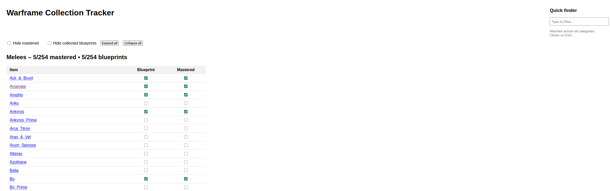

# Wftracker

A simple Warframe tracker to track your progress local to your machine. No account needed, no data sent to any server, and open-source.
Also accesses the Warframe Wiki easily from the app!

## Steps
### Installation
To install the required packages, run the following command:
```bash
    pip3 install -r requirements.txt
```

### Update resources/
To update the resources folder to the latest warframe wiki data, run the following command:
```bash
python update_resources.py
```

### Frontend tracker
To run the frontend tracker, run the following command:
```bash
python3 flask_app.py
```
Then open your browser and go to [http://locahost:5000](http://localhost:5000).
All data is saved when you click the "Save Progress" button. Do not forget to press it :).

All progress is saved in the file `progress.db` in the same directory you run the flask server from.
### Features:
- Tracks progress
- Filter by category
- Filter by name
- Clickable links to the wiki
- Portable and open-source!

### Screenshot


### Terminal-mode
To run the terminal-mode program, run the following command:
```bash
python3 main.py
```

### Credits
- [WfWikiFinder](https://github.com/umpanz/WfWikiFinder) for initial inspiration
